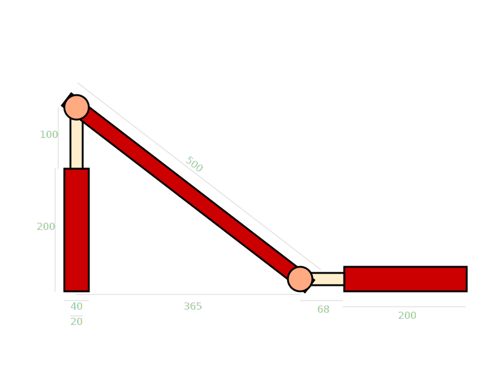

# tpa-homework1
## First Homework: Incredible Machines by Pietro Sannicolò
### Pistone regolatore dell'inclinazione di un piano 
L'obiettivo del mio progetto è quello di realizzare un device meccanico che riesce ad inclinare il proprio piano dell'angolo voluto dall'utente, per mezzo dell'estensione di due pistoni tra loro ortogonali.
Il device è quindi composto da 2 pistoni fissi a telaio e un piano inclinatore e può quindi avere vaste applicazioni nel mondo meccanico come posizionatore di precisione per utensili.

Schema del meccanismo prototipo `my-inclinatore.svg`

**Come lavora il programma:**
1. L'utente sceglie le dimensioni dei componenti;
2. Il programma verifica che tali valori inseriti siano:
	1. Coerenti fisicamente (positivi e non nulli);
    2. Coerenti con i componenti del device;
	Nel caso di mancata coerenza, viene chiesto di reinserire i valori;
3. Il programma stampa i dati inseriti;
4. L'utente sceglie il nome del file .svg contenente il device creato;
5. L'utente sceglie se stampare o meno le misure del device creato.

**Parametri chiesti:**
- Posizione device tramite le coordinate del cilindro dx;
- Larghezza dei pistoni;
- Raggio delle coppie rotoidali;
- Angolo di inclinazione del piano.

**Parametri fissi:**
- Larghezza e altezza dei cilindri;
- Lunghezza e spessore del piano;
- Distanza tra i cilindri.

**Vincoli dimensionali:**
- I parametri negativi (o nulli) non sono ammissibili;
- Il device deve essere contenuto interamente nel piano di dimensioni 800x600;
- Larghezza del pistone (sx/dx) non deve essere superiore (o uguale) a quella del cilindro (valore del cilindro (sx/dx) è fissa);
- Estensione del pistone (sx/dx) non deve essere superiore (o uguale) a quella del cilindro (valore del cilindro (sx/dx) è fissa);
- Il raggio della circonferenza (che simula una coppia rotoidale) non deve eccedere lo spessore del piano;
